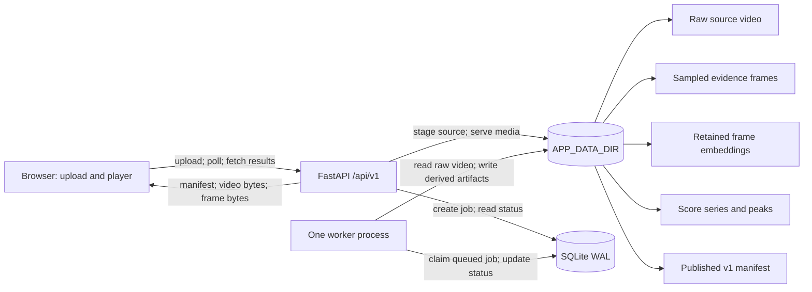

# Gecko Demo MVP architecture (ROB-14)

This document fixes the choices needed to implement ROB-2 through ROB-6. The
[HTTP API](api-v1.md), [storage and job model](storage-and-jobs.md), Pydantic models
in `backend/app/models/api.py`, and [v1 manifest fixture](../fixtures/manifest.v1.json)
are the corresponding interface contracts.

## Components and data flow

FastAPI handles upload, job polling, and read-only result/media routes. Its
responses use the existing Pydantic models; the video and frame routes stream
bytes. It does not run the video encoder inside the request process. One separate
worker process handles one job at a time on the same machine, reading queued jobs
from SQLite. SQLite is the durable queue and metadata store, so the MVP needs no
external broker. Both processes use the same `APP_DATA_DIR`; internal paths are
never sent to the browser. FastAPI's own [background-task guidance](https://fastapi.tiangolo.com/tutorial/background-tasks/)
notes that heavy computation may belong in a separate process.

The distinct artifacts are:

| Artifact | Purpose | Retention |
| --- | --- | --- |
| Raw source video | Immutable uploaded input and player source | Keep |
| Sampled frames | Encoder input and peak evidence images | Keep evidence frames; disposable intermediate frames may be removed |
| Image embeddings | Re-score with changed prompts without decoding video again | Keep with model and preprocessing metadata |
| Score series | Timestamped, normalized semantic similarity values | Keep |
| Manifest | Versioned frontend view of video, scores, peaks, and URLs | Keep |

## Sampling and scoring handoff

Use individual frames for v1; do not create scored clips. For a video of duration
`D > 0` seconds, request `N = min(180, max(1, ceil(D)))` frames at uniformly spaced
midpoints `t_i = D × (i + 0.5) / N`, for `i = 0 … N-1`. This is about one frame per
second for videos up to three minutes and at most 180 frames for longer videos.
Record each decoded frame's actual timestamp, ordered and unique, in the score
series. Resize/crop for the chosen encoder without changing the source video.
Evidence images use stable IDs derived from ordered frame indices.

The worker computes one image embedding per selected frame, then scores the
vectors against the configured positive and negative prompt sets. ROB-3 owns the
specific encoder, prompt set, and fixed mapping from similarity to `0–100`;
it must record the model, preprocessing, and scoring versions with the stored
embeddings/results. The mapping is the same across videos for a given version:
never scale each video's minimum and maximum independently. Scores represent
semantic similarity, not a calibrated probability or safety verdict.

For the v1 timeline, apply a three-sample median filter to raw per-frame scores
(use the available adjacent samples at the ends). Emit the resulting timestamped
samples. A peak is a local maximum of this final series with score at least `60`.
Keep peaks at least five seconds apart, preferring the higher score when two
compete, then return up to five highest peaks in descending score order. Each
peak refers to its sampled evidence frame and the positive prompt that contributed
most to its score. If none qualify, `peaks` is an empty list.

The manifest's `level` is a display bucket: `low` for scores below `40`, `medium`
for `40` through values below `75`, and `high` for `75–100`. These boundaries are
presentation defaults for the MVP and do not imply validated safety thresholds.
The fixture represents already processed UI data; its five-second sample spacing
is intentionally smaller than a real worker's approximately one-second sampling.

## One worker and restart behavior

The worker polls SQLite for a queued job, claims it transactionally, and processes
only that job. A FastAPI process restart does not stop this separate worker. A
worker crash, process restart, or machine reboot can interrupt a `processing`
job. On worker startup, an interrupted job is requeued under the same `job_id`,
its incomplete `work/` files are removed, and processing starts again from the
immutable source video. Allow one automatic restart retry; a second interruption
marks the job `failed` with a stable `WORKER_INTERRUPTED` error. Ordinary inference
or invalid-video failures mark it `failed` immediately. Publication of a validated
manifest and its referenced assets precedes the transition to `completed`.

Persist embeddings in `result/embeddings/vectors.npz` as aligned timestamps and
frame vectors, plus `result/embeddings/metadata.json` with encoder identifier,
model revision, preprocessing revision, vector dimension, dtype, and normalization
convention. Re-scoring may read these files for a new prompt/scoring version; it
must not silently reuse vectors produced by an incompatible encoder or
preprocessing version. The current v1 API creates one job per upload; a separate
re-score operation is outside the MVP API.

## Implementation boundaries

- ROB-2 implements the FastAPI routes and the SQLite/file lifecycle defined in
  the linked contracts, and starts one separately supervised worker process.
- ROB-3 implements frame extraction, embedding, scoring, smoothing, and peak
  selection with the parameters above; it writes a validated manifest and the
  retained vector metadata.
- ROB-4 uses `VideoUploadResponse` and `JobResponse` for upload and processing
  states. ROB-5 and ROB-6 can use the versioned fixture immediately; they consume
  `VideoManifest` URLs and timestamps without reconstructing scores or peaks.

The frontend can begin from the fixture while backend and ML implementation
proceed. The final API contract does not expose internal file paths or embeddings.
